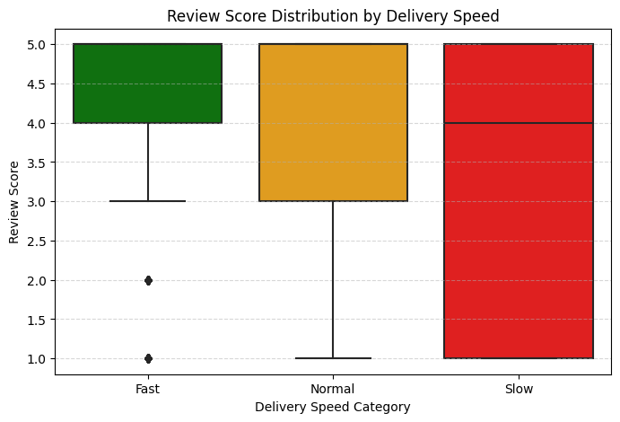
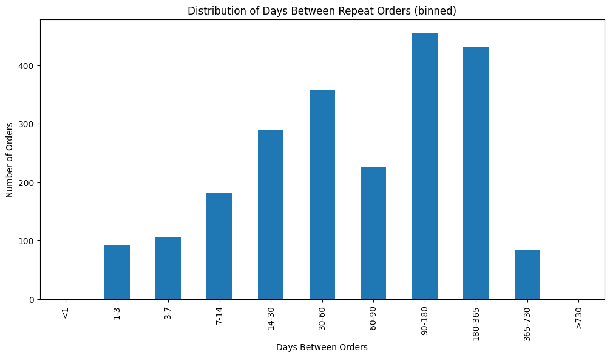
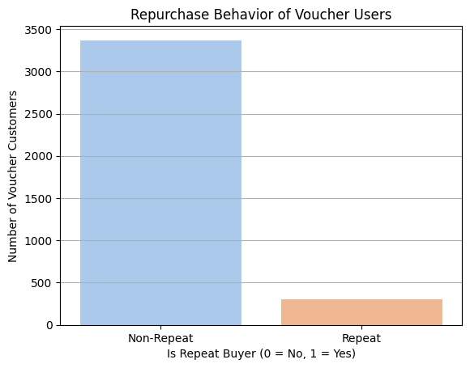
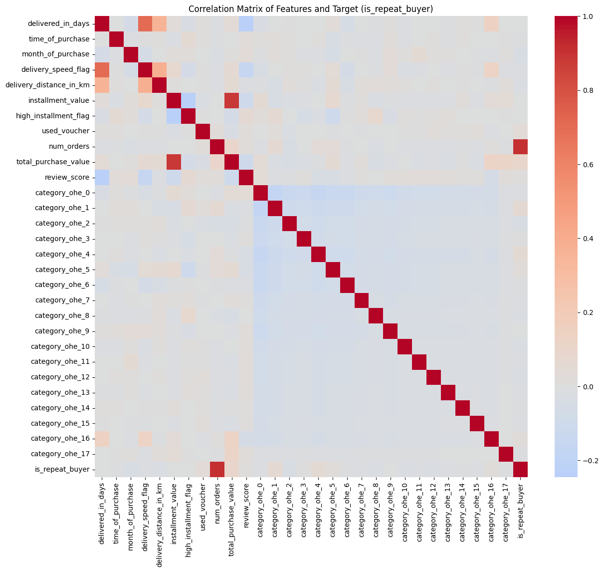
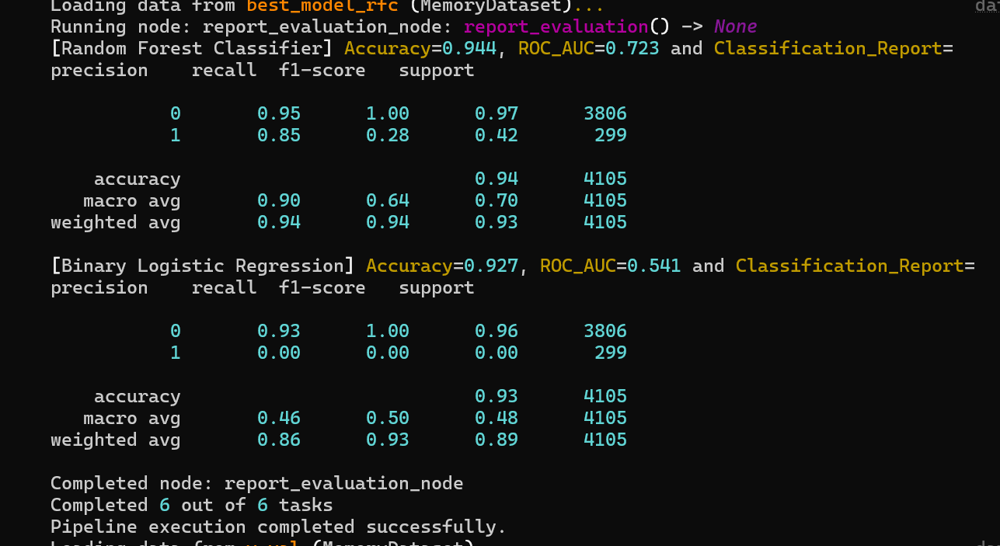

# EGT309_Project

[](https://kedro.org)

Made by yours truly, Women In Stem

Members:

Chua Jiawen 231836H - 231836H@mymail.nyp.edu.sg 

Goh Xin Leng Christel 220980C - 220980C@mymail.nyp.edu.sg 

Wong Yen Yi 230666M - 230666M@mymail.nyp.edu.sg 

Yoshana Magendran 230591E - 230591E@mymail.nyp.edu.sg

## Programming language, libraries and packages used

1. Python 3.9 should be installed to run jupyter notebook https://www.python.org/downloads/release/python-3911/
2. Code Editor with Python 
3. Docker Desktop https://www.docker.com/products/docker-desktop
4. Anaconda prompt for faster processing speed https://www.anaconda.com/docs/getting-started/anaconda/install

To run Pyspark 3.3.1, Java 8 or 11 needs to be downloaded. Here are the steps to do so:
1. Download Java 8 for windows here (any 1): https://www.oracle.com/java/technologies/downloads/#java8   https://adoptium.net/en-GB/temurin/releases/?version=8&os=any&arch=any
2. Save the file into path given by system ("C:\Java\jre1.8.0_441")
3. Search for “Edit system environment variables”. (Administrator Rights)
4. Select “Environment Variables” located at the bottom right of the pop-up.
5. Under “System Variables”, click on “New” and enter the following:

   Variable name: JAVA_HOME 
    Variable value: (enter the path to your java 8 program file)
   Variable value should look like this -> C:\Java\jre1.8.0_441

6. Click ‘OK’ after entering the above information
7. Locate ‘Path’ under system variables and click on it.
8. Still in system variables, press on “Edit”, then “New”.
9. Enter the following: %JAVA_HOME%\bin and click on it after you create it.
10. Then, move %JAVA_HOME%\bin all the way to the top of the list.
11. After this, pip install pyspark in terminal and you will be able to run the eda!

To run Kedro-pipeline, Java 8. Spark 3.5.6 and Hadoop 3.0.1 needs to be downloaded. Here are the steps so for Spark and Hadoop:
1. Download Spark for windows here: 
   https://www.apache.org/dyn/closer.lua/spark/spark-3.5.6/spark-3.5.6-bin-hadoop3-scala2.13.tgz
   Fork the github repository for Hadoop from here: [hadoop - 3.0.1bin]
   https://github.com/cdarlint/winutils/tree/master
2. Extract the repository into your local drive. Please save this specific folder, [hadoop - 3.0.1/bin] into your (‘C:\Hadoop’) folder. 
3. Save the downloaded Spark file into (‘C:\Spark’)
4. Search for “Edit system environment variables”. (Administrator Rights)
5. Select “Environment Variables” located at the bottom right of the pop-up.
6. Under “System Variables”, click on “New” and enter the following:

	Variable name: SPARK_HOME
	Variable value: (enter the path to your spark program file)
	Variable name: Hadoop_HOME
	Variable value: (enter the path to your hadoop program file)

7. Click ‘OK’ after entering the above information 
8. Locate ‘Path’ under system variables and click on it.
9. Still in system variables, press on “Edit”, then “New”. 
10. Enter the following: %SPARK_HOME%\bin and %HADOOP_HOME%\bin, and click on it after you create it.
11. Then, move the files all the way to the top of the list after Java. 

USE this websites for Reference: 
https://medium.com/@marcelopedronidasilva/how-to-install-and-run-pyspark-locally-integrated-with-vscode-via-jupyter-notebook-on-windows-ff209ac8621f


Libraries needed will be installed in later part


## EDA Key findings

### Data Quality Issues
#### 1. Zero installments in payments
Before data cleaning was done, I had explored the datasets and found some interesting points about the given datasets. Starting off with “olist_order_payments”, I discovered that there were two transactions which had 0 as their number of installments. Logically speaking, if the purchase was paid in full, the number of installments would be 1 instead of 0. As this error was a very small fraction of the dataset (2 out of 103,875 transactions = 0.00193%), I decided to remove these 2 transactions, as it may have just been a data entry error, to maintain data integrity. 

#### 2. Invalid review timestamps
Another error that I discovered was incorrect timestamp entries, where the review was made before order was delivered. When checking if the dates for delivery was after the order_approved_at date, I joined it with olist_order_reviews to check if the “review_creation_date” was after “order_delivered_customer_date”. There were several entries where reviews were created before their order was delivered. Firstly, this affects the accuracy of the review score given as the customer did not review it based on the delivery speed or product. Secondly, a customer would not be able to review a product before receiving it. Hence, these rows were removed as it may affect sentiment or customer satisfaction analysis.

### Outlier Detection & Feature Engineering
#### 1. High installment transactions
While checking for outliers, I discovered payment transactions which were extremely high in value. To help the model better understand and handle these values, I engineered a function, “high_installment_flag”, to categorize installments into 1 or 0, where 1 indicates that the installment value is more unusual compared to the usual transactions. 

A high installment flag is assigned to orders when: 
- The number of installments is above average, or
- The value of per installment paid is lower than average, even after outlier capping. 

The flags were assigned using the IQR method to cap outliers, followed by comparing each transaction’s capped value to the overall average value. This feature will help the model to understand customer behaviour, which can identify customers stretching out payments or opting for long-term installment plans.


#### 2. Voucher Usage
Another feature created was ‘used_voucher’, which identifies whether a customer has used a discount voucher for their payment. This gives insights into customer purchasing power and customer loyalty as:
- Customers who are using vouchers for their payments are not paying for the item directly or are purchasing at a discounted rate, suggesting lower purchasing power or a higher sensitivity to price. 
- These customers are drawn in by promotions and are less likely to make repeat purchases without discounts, affecting customer loyalty and retention.
Hence, vouchers may attract more customers, but may not retain them permanently.


### EDA Visualisations & Insights
#### 1. Review Score Distribution by Delivery Speed

This boxplot shows the distribution of review score (1-5) across the delivery speed categories (fast, normal and slow). Based on the graph, the IQR for fast delivery speed is between 4.0 to 5.0, with a few outliers of 1 and 2 stars reviews. For normal delivery speed, the IQR is ranging from 3.0 to 5.0, however the whiskers reaches down to 1.0. For slow delivery speed, although the median is around 4.0, the IQR stretches from 1.0 to 5.0. From this, it shows that fast deliveries generally lead to a higher satisfaction rate, while slow deliveries cause customers to be unpredictable, leading to a wide range of review scores and also low reviews. Hence, delivery speed will affect customer experience, no matter what product it is.

#### 2. Distribution of Days between Repeat Orders (binned)

The bar graph shows how frequent customers place orders, from their last order till their latest one. From this graph, the range of days which have the highest number of repeat customers are 90-180 days, followed by 180-365 days. Bins from 14-30 days and 60-90 days also have a high volume of repeat orders, suggesting that a large number of customers reorder within 1 to 3 months. 

On the contrary, there are little orders made within 1 week, indicating that the platform does not sell products/services that are consumable on a daily/weekly basis. With a higher concentration of buyers reordering during the 3-12 months period, it shows that long-tem engagement would be much more effective in retaining customers than focusing on swift purchases, due to the nature of products being sold on this platform.

#### 3. Repurchase Behaviour of Voucher Users

The bar graph shows the number of voucher users who are repeat and non-repeat buyers. The majority of voucher users are non-repeat, while only a small percentage of voucher users are repeat buyers. This shows that vouchers are effective in bring customers to the platform to purchase items, but are ineffective in retaining them, as many are non-repeat buyers.

#### 4. Correlation matrix

With the red box having a strong positive correlation, most of the features are white (no correlation). Initially, I did one-hot encoding on product categories aas our model could only take in numerical values. However, I decided to remove most of the features which were the one-hot encoded categories as they were mostly white. 

Features like “delivered_in_days” had a strong correlation with: 
a. “Delivery_distance_in_km” (longer distance = longer delivery time)
b. “delivery_speed” (slower speed = more days taken to deliver)
c. “month of purchase” (different seasons may affect delivery time)

“High_installment_flag” is also strongly correlated with “installment_value” which could be because it was derived from installment_value itself. 


## Instructions for setting up for the project

1. Open linux terminal/anaconda prompt to run  

2. Path the file using cd

Use double quotes “ if the path has spaces

Windows
```
cd "C:\Users\Documents\Project"

```

Linux 
```
cd "/home/username/Documents/Project"

```

3. Create a virtual environment
   
Conda
```
conda create -n venv python=3.9
```
Linux (install python if needed)
```
sudo apt install python3.9 python3.9-venv
python3.9 -m venv venv

```
4. Activate virtual environment 

Conda
```
conda activate venv
```
Linux
```
source venv/bin/activate
```

5. Install the dependencies by running

```
python -m pip install --upgrade pip
```
```
pip install -r requirements.txt --prefer-binary --no-cache-dir

```
6. Start Docker Desktop in the background

Note: You don't need Docker to run EDA in the file — it's optional.

To install the EDA kernel for Jupyter file to run in code editor:
```
python -m ipykernel install --user --name=edavenv --display-name "Python (EDAvenv)"
```

Open the code editor and find the ipykernel created to run eda


To run the pipeline without Docker:

Conda 
```
kedro run
```

Linux
```
bash run.sh
```

Docker file for 1. JupyterLab and 2. Run.sh
1. Build JupyterLab Docker Image and run it 
```
docker build -t jupyter-image -f Dockerfile.jupyter . 
```
This may take around 45 minutes as there is a lot to download from our dependencies

Running Docker image created
```
docker run -d -p 8888:8888 jupyter-image
```
Check if docker file is running, then open a new tab on the browser to run local host
```
docker ps
```
```
http://localhost:8888/lab?
```

2. Build Pipeline Docker Image and run it
```
docker build -t kedro-image -f Dockerfile.runner .
```

Pipeline Docker Image
```
docker run --rm kedro-image
```
Run.sh and the pipeline will start running


Refer to troubleshooting tips if encountered problem


## Flow of pipeline

Dataprep - feature engineering, combining the features, processed to extract the features used for model training. 
Model - split the model, train random forest classifier model, train binary logistic regression model, evaluate the models. 
Model_report - display the confusion matrix of the results in kedro visualization, and display a png in the visualisation folder. 

## Choice of machine learning model
The Machine Learning Models Chosen: Random Forest Classifier and Binary Logistic Regression. 

Random forest model was chosen as it has an excellent accuracy which is robust to overfitting. It is able to handle large datasets and interpretable via feature importance. The random forest model is known as the collection of decision trees that work together to make predictions. Thus, random Forest was selected as our primary model due to its robustness and consistent performance across metrics.

Binary Logistic Regression is a fast and interpretable statistical algorithm, often used as a strong baseline model in classification tasks. It is particularly useful for identifying key contributing features due to its straightforward coefficient interpretation. The model helps analyze the relationship between independent variables and the dependent variable, especially when this relationship is approximately linear in the log-odds space.

## Model evaluation
The model evaluation metrics chosen for both the models were accuracy score, classification report [ F1-score, recall, precision and support ] and ROC-AUC score. 

Definition of the Chosen Metrics: 
Accuracy is the percentage of correct hits, measuring the overall performance. 
F1-score is a weighted average of precision and recall. 
Recall measures the prediction performance of the actual positive instances. 
Precision measures the accuracy over the predicted positive instances, indicating the percentage of wrongly identified as positive.
Support refers to the number of samples in each class. Support uses the ground truth labels, which represents the actual classes of each sample. 
Confusion Matrix is used to measure how well a classification model is performing. 

The accuracy was chosen as a metric to evaluate the models because it gives a quick overview of the model’s overall performance where i can easily classify if my model is doing well or it would need hyperparameter tuning. F1-score was chosen as a metric to evaluate the models as it combines precision and recall into a single metric which offers a balanced view of both false positives and negatives. The recall was chosen as a metric to evaluate the model as it measures the model’s ability to correctly identify actual positive cases. Precision was chosen as a metric to evaluate the model as it indicates how many of the positively predicted instances were actually correct.

Confusion matrix was chosen as it shows a detailed review of how the classification model performs across all classes and error types. The classification model would enable a better idea of the model outcome, and it helps the tuning and optimization process. Thus, displaying a confusion matrix would help us understand the distribution of the classes more efficiently. 

# Results

Random Forest Classifier:
The accuracy score was 0.944. 
The roc_auc score is 0.723
From the classification report, the precision is 0.95,  recall is 1.0, f1 score is 0.97 and for class 0, while  precision is 0.85, recall is 0.28 , f1 score is 0.42 and for class 1. 

Model has a high performance on Class 0 - (non-repeated buyers).
Poor recall (0.28) for Class 1, indicating many false negatives.
ROC AUC = 0.723 suggests the model moderately distinguishes between classes. 
This suggests that the data is highly imbalanced, having more class 0 than class 1. Our model is more accurate in identifying the non-repeat buyers. 

The confusion matrix suggests that the model is able to identify the (0) more than (1), not-repeated buyers then repeated buyers. This is due to the imbalance of dataset during training since more not-repeated buyers are present. 

Binary Logistic Regression:
The accuracy score was 0.927. 
The roc_auc score is 0.541. 
From the classification report, the precision is 0.92,  recall is 1.0, f1 score is 0.96 and for class 0, while  precision is 0, recall is 0, f1 score is 0 and for class 1.

This model performs worse for minority class.
Class 1 is completely ignored by the model.
ROC AUC = 0.541 is barely above random chance (0.5), suggesting poor separation capability. This suggests that there is a class imbalance in the dataset since Class 0 dominates the dataset, and the model is not able to scale it to be trained. 

The confusion matrix suggests that the model is able to identify the (0) more than (1), not-repeated buyers then repeated buyers. This is due to the imbalance of dataset during training since more not-repeated buyers are present. 

The Random Forest Classifier outperforms Binary Logistic Regression in handling the imbalance and offers better identification of repeat buyers. While it still shows poor recall for Class 1, it is more capable of distinguishing between the classes and provides a stronger baseline for improvement. Addressing class imbalance through resampling or class weighting is recommended to further enhance model performance.

## Other Consideration

Troubleshooting tips

If powershell block script execution for conda
```
Set-ExecutionPolicy RemoteSigned -Scope Process
```

If Docker is taking a lot of space

```
# Remove all stopped containers
docker container prune

# Remove all unused volumes
docker volume prune

# Remove unused images
docker image prune

# Remove unused network
docker network prune

­# Remove all unused containers, volumes, images (in this order)
docker system prune
```
If port 8888 is used, try other ports
```
docker run -d -p 8899:8888 jupyter-image
```
if run.sh: $'\r': command not found: convert to unix(LF) or a code editor
```
dos2unix run.sh
```


